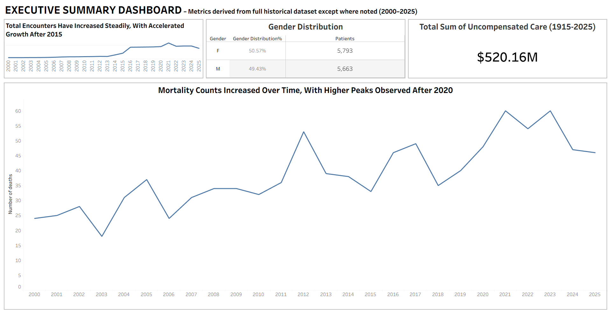
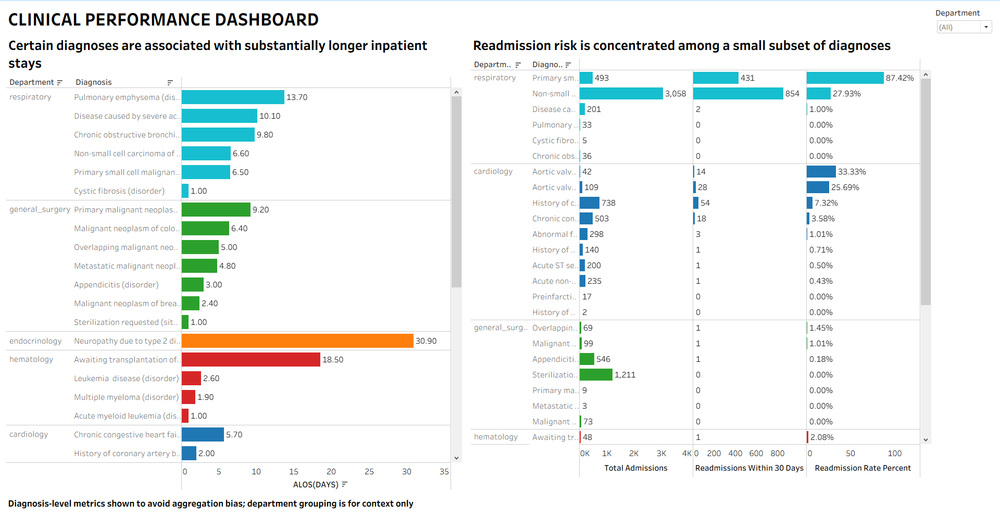
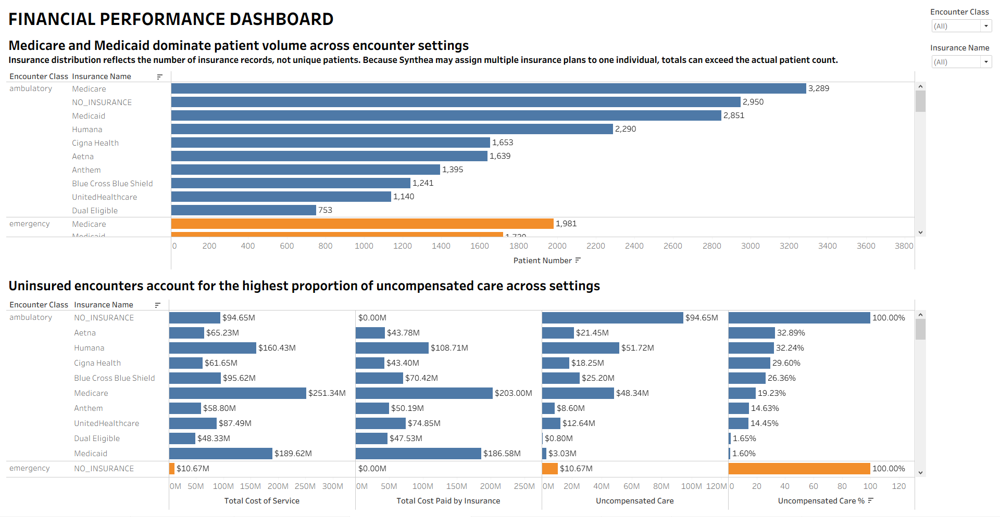
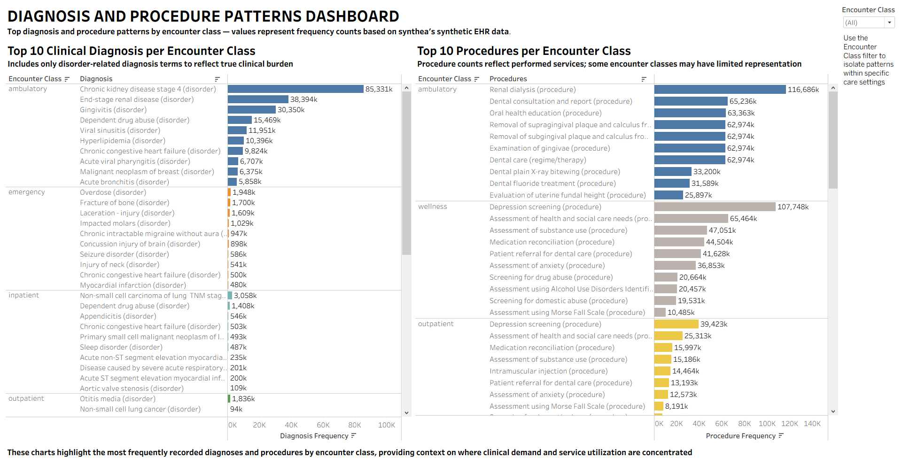
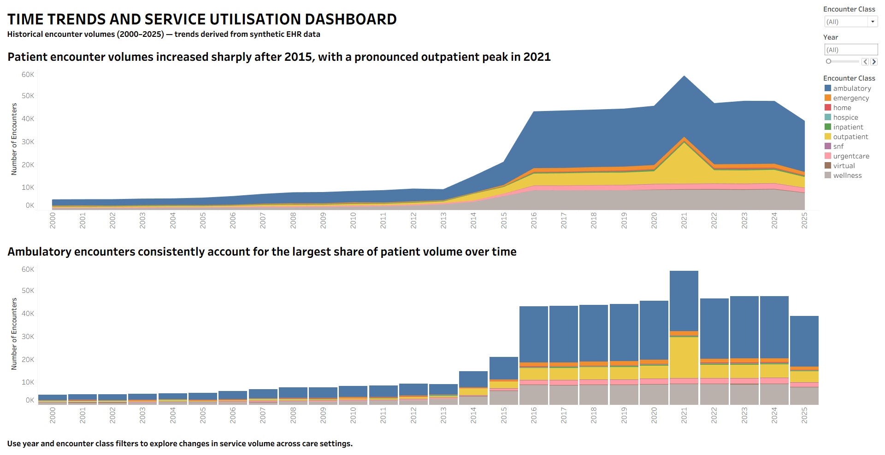

# Hospital Performance and Payer Insights
## Operational, Clinical, and Financial Insights from Synthetic EHR Data

## Executive Overview

Hospitals operate in an environment of increasing clinical complexity, financial pressure, and rising demand for timely, high-quality care. Leadership teams require clear, data-driven insights to understand where operational bottlenecks exist, which clinical areas drive risk and cost, and how patient utilisation patterns are evolving.

This analysis was conducted to support hospital performance monitoring and payer exposure assessment, with insights and recommendations focusing on four core domains:
- Clinical performance (length of stay and readmissions)
- Financial exposure (uncompensated care and payer distribution)
- Diagnosis and Procedure utilisation patterns (high-volume clinical conditions and services)
- Service utilisation and demand trends (encounter volumes by care setting)

Using encounter-level electronic health record (EHR) data, the project evaluates how patient flow, clinical outcomes, and financial risk vary across encounter classes, diagnoses, and payer types. The goal is not just retrospective reporting, but to provide leadership with actionable insights to inform resource allocation, quality improvement initiatives, and payer strategy. While based on synthetic data, the analysis is intentionally structured to mirror real-world hospital performance analytics and decision-making workflows.

- Tableau Story Presentation (Interactive Dashboards): [link to be added]
- SQL Queries Used for Analysis: [Available here](https://github.com/uduak33/hospital-performance-and-payer-insights/blob/main/sql_scripts) 
- Synthetic EHR Dataset (Synthea): [Download here](https://drive.google.com/file/d/1MbpiKEOvP2GoirC1C_gbqNuwcTseC3Cg/view?usp=drive_link)
- Entity Relationship Diagram (ERD): [View here](https://drive.google.com/file/d/1uaJcTt5IJoImHiWCTbFmnAwpUeNv5Lja/view?usp=drive_link)

## Data Structure & Initial Checks

The analysis is based on encounter-level electronic health record (EHR) data generated using Synthea, an open-source synthetic patient generator. Although the data is synthetically generated, it is treated throughout this analysis as a proxy for real hospital data, with clinical and operational assumptions consistently applied to reflect real-world hospital operations.

### Data Generation Context

Data generation date: 25/10/2025
Project analysis period: 01/11/2025 – 17/12/2025
Encounter history covered: 2000–2025 (with certain financial fields extending the entire dataset)

The Synthea generator produced a relational dataset comprising 18 core tables. For this analysis, only tables directly relevant to hospital operations, clinical performance, and payer exposure were retained.

### Tables Used in Analysis

Out of the full Synthea schema, five tables were used:
- patients – patient demographics and identifiers
- encounters – encounter-level activity, dates, encounter class, outcomes, and utilisation
- procedures – performed clinical services linked to encounters
- payers – insurance coverage and payer attributes
- inpatient_department_mapping – custom table created to support inpatient clinical analysis

### Custom Clinical Modelling Decisions

To support clinically valid analysis of length of stay (LOS) and readmissions, a custom inpatient_department_mapping table was created.
- Departments were clinically inferred from diagnosis descriptions rather than relying solely on raw encounter class labels.
- This mapping was performed manually using clinical expertise to align diagnoses with realistic inpatient service lines (e.g., respiratory, cardiology, general surgery).
- The approach reflects how inpatient analytics are typically structured in real hospital environments, where diagnosis context—not encounter labels alone—drives departmental attribution.

### Initial Data Validation & Quality Checks

Before analysis, the following checks were performed:
- Verified unique patient and encounter identifiers
- Confirmed date continuity and encounter sequencing
- Validated LOS calculations using encounter start and stop timestamps
- Ensured readmission logic aligned with 30-day inpatient readmission definitions
- Reviewed payer assignments to confirm that multiple insurance records per patient were expected and appropriate

No material data integrity issues were identified that would invalidate descriptive or directional analysis.

## Executive Summary

Hospital encounter volumes have increased substantially over time, driven primarily by ambulatory care growth, while clinical efficiency and readmission risk remain concentrated within a limited subset of diagnoses. Financial exposure is driven less by overall volume and more by payer mix, with uninsured encounters accounting for the highest proportion of uncompensated care. Together, these patterns highlight clear opportunities for diagnosis-level operational improvement, targeted financial interventions, and forward-looking capacity planning.

  

*The Executive Summary Dashboard provides a high-level snapshot of hospital activity, patient mix, financial exposure, and mortality trends across the full historical period. It is designed to give leadership an immediate sense of scale, risk, and directional trends before deeper diagnostic analysis*

## Insights Deep Dive
### Clinical Performance (Length of Stay & Readmissions)

- Inpatient length of stay is disproportionately driven by a small set of high-acuity diagnoses, notably respiratory conditions (e.g., pulmonary emphysema, COVID-19–related disease), oncology-related admissions, and select endocrine and haematology cases, with some diagnoses exceeding 20–30 days on average.
- Readmission risk is similarly concentrated, with non-small cell lung cancer and select cardiac conditions accounting for a large share of 30-day readmissions despite representing a minority of total admissions.
- High readmission percentages in low-volume diagnoses indicate condition-specific care complexity rather than system-wide failure.
- Diagnosis-level analysis reveals substantial variation within departments, reinforcing that department-level averages would mask operational risk.

These patterns highlight clear opportunities for targeted clinical pathway optimisation, discharge planning, and post-acute follow-up focused on high-impact diagnoses.

### Financial Performance

- Medicare and Medicaid account for the largest share of patient encounters across nearly all encounter classes, particularly in ambulatory, outpatient, emergency, and inpatient settings, indicating strong reliance on public payers for service volume.
- Despite lower encounter counts relative to insured populations, uninsured encounters contribute a disproportionate share of uncompensated care across all settings, reaching 100% uncompensated rates by definition.
- Uncompensated care exposure is most pronounced in high-volume outpatient and inpatient settings, where uninsured encounters translate into substantial absolute financial losses.
- Private insurers and Medicare generally offset a significant portion of service costs, but gaps remain across encounter classes, particularly where reimbursement does not fully cover the total cost of care.

Overall, payer mix—rather than total encounter volume alone—is a key driver of financial risk, highlighting the importance of payer strategy and coverage optimisation.

### Diagnosis and Procedure Patterns

- Diagnosis patterns vary markedly by encounter class, reflecting distinct clinical burdens across care settings. Ambulatory encounters are dominated by chronic conditions such as chronic kidney disease stage 4 and end-stage renal disease, while acute events, including overdose, fractures, and lacerations, drive emergency visits.
- Inpatient diagnoses cluster around high-acuity conditions such as lung cancer, heart failure, and myocardial infarction, whereas hospice and wellness settings show predominance of end-of-life and chronic disease management diagnoses.
- Procedure utilisation mirrors these patterns: ambulatory care is heavily driven by renal dialysis and dental services, wellness encounters emphasise screening and psychosocial assessments, and inpatient care is characterised by chemotherapy, respiratory support, and advanced imaging.
- Emergency and urgent care procedures centre on screening, stabilisation, and initial assessments, highlighting their role as acute access points within the care continuum.

### Time Trends & Service Utilisation
- Patient encounter volumes rose sharply after 2015, marking a structural shift in service utilisation rather than gradual organic growth.
- Ambulatory care consistently dominated total volume, reinforcing its role as the primary driver of system-wide patient throughput.
- Outpatient services peaked markedly in 2021, reflecting pandemic-era care deferral followed by release demand and service reconfiguration.
- Emergency, inpatient, and post-acute services increased modestly, suggesting stable acuity demand relative to rapid outpatient expansion.
- Virtual and wellness encounters surged post-2019, indicating durable adoption of preventive and remote care models beyond the pandemic period.

## Recommendations & Next Steps
### 1. Clinical Operations Optimisation
- Prioritise diagnoses associated with prolonged length of stay for clinical pathway review, care standardisation, and multidisciplinary workflow redesign to reduce inpatient inefficiencies.
- Target high-readmission diagnoses with enhanced discharge planning, transitional care coordination, and post-acute follow-up to improve continuity of care and reduce avoidable utilisation.
- Maintain diagnosis-level performance monitoring as a core analytic approach, as department-level aggregation alone may obscure clinically meaningful variation and misdirect operational interventions.

### 2. Financial & Payer Risk Management
- Closely monitor uninsured encounter trends, as they represent a persistent source of uncompensated care and heightened financial exposure across service lines.
- Expand payer enrollment, eligibility screening, and point-of-care financial counselling, positioning these interventions as revenue protection mechanisms rather than administrative overhead.
- Leverage payer mix insights to inform contract negotiations, reimbursement optimisation, and service-line prioritisation, aligning clinical demand with sustainable revenue models.

### 3. Capacity & Demand Planning
- Incorporate post-2015 encounter growth patterns into long-term staffing, infrastructure, and service expansion plans, recognising the shift as a structural demand change rather than a temporary surge.
- Explicitly model outpatient demand volatility, including observed pandemic-era spikes, to stress-test capacity plans and avoid future access bottlenecks.
- Use longitudinal utilisation trends to support forward-looking scenario planning, enabling proactive resource allocation rather than retrospective performance assessment.

## Assumptions & Caveats
### 1. Patient Insurance Attribution
- Synthea permits patients to hold multiple concurrent insurance coverages, limiting definitive primary payer attribution at the encounter level. Payer mix results, therefore, reflect coverage presence rather than exclusive insurer responsibility.
### 2. Encounter-Level Financial Attribution
- Encounter records could not be reliably reconciled to transaction-level payment data due to structural misalignment. Financial interpretations, therefore, reflect utilisation and exposure based on encounters rather than confirmed payment outcomes.
### 3. Admission Classification Decision
- Hospice and skilled nursing facility (SNF) encounters were initially considered for inclusion as admissions but were excluded for consistency. Admission-related analyses were restricted to inpatient encounters only to maintain a clear and reproducible definition.
### 4. Clinical Coding Framework
- The dataset natively uses SNOMED CT, enabling granular clinical analysis and diagnosis-level grouping. Findings may require additional mapping for billing or administrative workflows that rely on ICD-based reporting.
### 5. Hospital-Level Aggregation Assumption
- Although multiple organisations exist in the dataset, encounters were analysed as a single consolidated hospital system due to inconsistent facility identifiers. Results, therefore, reflect system-wide trends rather than individual hospital performance.
